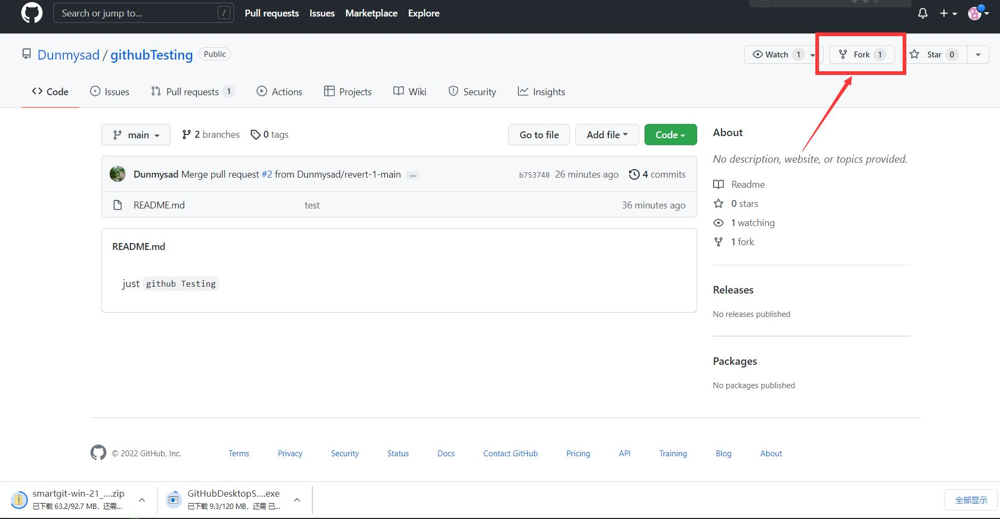

# github :


先注册github账号    打不开的可以使用加速器（[uu加速器](https://uu.163.com/)搜索学术加速)或者其他途径 （梯子等）

## 进入想要fork的主页  即相应的工程项目  


## 先进行fork到自己的仓库


## 到自己的仓库将ssh 复制下来


## 将fork的文件 `clone` 到本地的电脑
```bash
git clone git@github.com:AXianYou/githubTesting.git
```


## 在进行代码修改完成后，将文件`push`至自己的仓库(push之前最好进行一次pull，保证自己的代码为最新的代码，确保不会造成损失)

```bash
git add .
git commit -m "testing"
git pull
git push
```


## Pull requests（将代码提交给我）


##  完成提交　　　下一次进行更改时首先fork一次　　将最新的代码下载到本地


##  第一次上传文件时，需要指定相应的仓库地址：

##  　　　
